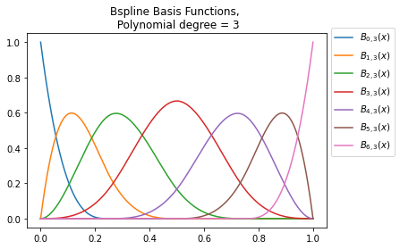

## Experimentation with B-Splines

This code implements and visualises the B-splines basis functions. We implement these functions from scratch. This is a good exercise to check that I am understanding what's going on under the hood.

### Dependencies
- numpy 1.20.1
- Matplotlib 3.3.4

### Useful material
I found the following links helpful:
- https://en.wikipedia.org/wiki/De_Boor%27s_algorithm
- https://cran.r-project.org/web/packages/crs/vignettes/spline_primer.pdf

### Visualisation of B-splines basis functions
To compute the B-spline bases, we need to specify:
1. The degree of the polynomial,
2. the vector of knot points,
3. a vector containing the observations (x) for plotting the functions.

The resulting number of basis functions is given by = (# of knot points) - (degree of polynomial + 1) 

#### Example 1: Cubic B-splines functions
```
spline_degree = 3
knots = [0,1/4,2/4,3/4,1]
x_list = np.linspace(0,0.99999,1000)

plots = Bspline_plots(x_list, knots, spline_degree=spline_degree)

plots.plot_bases()
```


